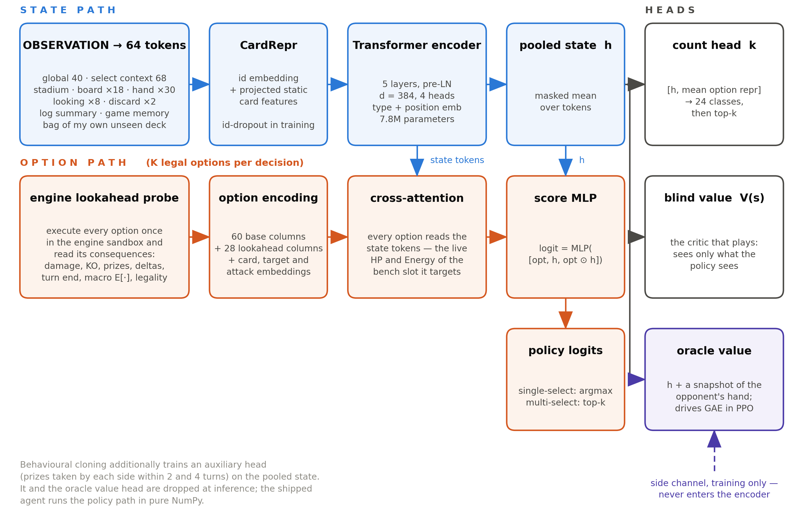
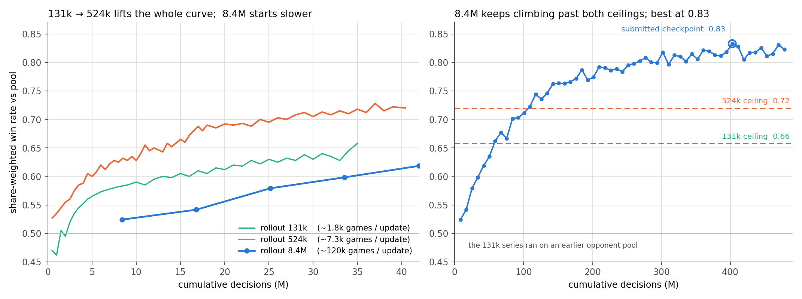
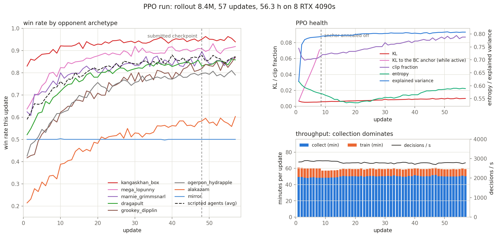

# Lookahead as Input, Not Search

**Subtitle:** Rank 9 of 6,807 and a gold medal in the Simulation track, from a 7.8M-parameter policy that never searches at play time.

**TL;DR.** Both final submissions are the same Ogerpon–Hydrapple deck and the same weights. Training ran on one node of 8 RTX 4090s and 150 CPU actors; the final PPO run took 56 hours. Every legal option is executed once inside the engine and its consequences appended as 28 features, so the network reads what a card does instead of memorising its id. Training is behavioural cloning on 136k replays, then PPO against a pool rebuilt from the live arena. Rollout size was the biggest lever; MCTS at play time made the agent worse.

Thank you to Kaggle and all the organizers for a fiercely contested competition.

---

## 1. Deck: Ogerpon–Hydrapple

An **archetype** is a family of lists sharing a core, so anything built around Dragapult ex is `dragapult`; an **exact list** is one specific 60 cards. The 12 Aug arena held 14 archetypes but 148 exact lists.

**Game plan.** Mono-Grass energy acceleration. *Teal Dance* and *Ripening Charge* attach a Basic {G} for free each turn, *Wild Growth* makes each one count double, and both attacks add 30 damage per Energy, reaching OHKO range on 330 HP by turn 3–4.

| Role | Cards | Why |
|---|---|---|
| Attackers | 4 Teal Mask Ogerpon ex, 2 Hydrapple ex | Free attachment, scaling damage; Ogerpon is a Basic |
| Engine | 2 Meganium line, 4 Forest of Vitality, 14 {G} Energy | Wild Growth doubles each attachment; Forest lets {G} Pokémon evolve the turn they land |
| Consistency | 4 Bug Catching Set, 4 Ultra Ball, 2 Poké Pad, 2 Dawn, 4 Lillie's Determination, 2 Meowth ex | Draw Energy and Pokémon at once |
| Recovery | Night Stretcher, Lana's Aid, 2 Boss's Orders, Judge, Unfair Stamp, Fezandipiti ex | Recover Energy after a KO; Boss's Orders picks the next target |
| Non-ex outs | 2 Meganium (140), Tapu Bulu (220) | Ignore ex-only damage prevention |

**Why this deck.** I classified the daily replay dumps (136k episodes, 14 Jul–12 Aug) into archetypes. Of the five most-played, Ogerpon–Hydrapple had the best arena win rate at 53.9% over 904 games, while Dragapult managed 52.5% and Grimmsnarl 44.1%. I took its most-played exact list, which 26 teams were running. Because the list is public I met the same 60 cards often enough to measure policy quality with the deck fixed. Its weakness is structural: every attacker is ex, so a Sylveon *Safeguard* wall shuts them all off.

## 2. Model architecture

The network is shown below.

*Model architecture*

**Tokens.** The observation becomes a 64-token sequence: global, select context and stadium, 18 board slots, 30 hand slots, 8 "looking" slots, two discard bags, a log summary, a game-memory token, and a bag of my own unseen deck. Every card slot is a **CardRepr**: a learned id embedding plus a projection of the card's static features, HP, type, stage, ex flags, and a hand-audited schema of its Ability and attack text. The id half is randomly dropped per slot in training, so a rare card still reads from its text. A 5-layer pre-LN transformer (d = 384) encodes the sequence into the pooled state *h*.

**Options are first-class.** Each legal option gets its own embedding, built from its feature vector plus the card, target and attack it refers to. That embedding cross-attends to the state tokens, so an option meaning "target bench slot 3" reads the live HP and Energy of that slot. Scoring is `logit = MLP([opt, h, opt ⊙ h])`, and multi-select prompts add a count head.

## 3. Feature engineering

The principle is to ground the option, not the card: everything the network could otherwise only memorise from an id is written out as a number. Widths below are float columns plus integer card and attack ids.

| Block | Width | What it encodes |
|---|---|---|
| Global | 40 + 21 | Turn and action counts, first-player flags, supporter/stadium/energy/retreat used; per-side deck, hand, prize, discard, bench counts; Active conditions; a 15-archetype opponent-deck posterior |
| Board × 18 | 32 + 4 ids | Present/known, HP and damage, appeared-this-turn, Energy count and types, tools, evolution depth; Pokémon, tool, Energy ids |
| Hand / looking / discard / deck | ids | 30 hand ids; 8 revealed cards; masked-mean discard bags; my 60 minus every visible zone |
| Log + memory | 26 + 26 ids | Since my last decision: attacks, KOs, cards revealed into their hand. Cumulatively: play/attach counts, last 4 attacks per side, 12 known cards |
| Option | 60 + 28 | Type, area, index, card/target/attack ids, owner, log-scaled counts, target HP and Energy, plus 28 engine-lookahead columns |

**Engine lookahead.** Every main-phase option is executed once in the engine's search sandbox and its public consequences read back: damage, KO, prizes won and lost, hand and deck deltas, turn handover, win or loss. On top come a macro expansion over forced chains and coin flips, and a legality delta counting how many attacks become legal afterwards, so "this card enables Hydrapple's attack" is an input rather than a memorised combo. Hidden zones get fixed-seed filler that a test confirms never reaches the features; the same probe runs in training and at inference.

## 4. Training

**Stage 1, behavioural cloning.** The data is every decision by both sides of all 136k episodes, with the probe run on each. The replays mix players of very different strength, so samples are weighted: winner 1.0 against loser 0.3, a 10-day recency decay, an upweight for higher-rated games. One shared base is trained across all 14 archetypes at once, then fine-tuned into 12 anchors; the other two are too rare to be worth one, at 0.4% of arena slots for Mega Froslass and none for Mega Venusaur. Training each archetype from its own slice fails on data volume: when to attach, evolve, retreat or spend a Supporter is deck-independent and wants the whole corpus, while one archetype is a few percent of it.

**Stage 2, value fine-tune.** PPO's advantage is a return minus V(s), so an uncalibrated critic makes the first bounded steps chase value error rather than policy improvement. BC's value head does not transfer, because it never saw the states the policy visits. The trunk of the Ogerpon–Hydrapple anchor is frozen, so play stays bit-identical, and both critics are regressed on the outcomes of 12k self-play games.

**Stage 3, PPO.** The policy starts from that value-tuned anchor, and the pool reproduces what the ladder serves:

- **70% arena replica.** From the 12 Aug replay zip I measured the share of every exact list and reproduced the top 40 in proportion, each piloted by the Stage 1 anchor of its archetype. The day's most-played list, a Marnie's Grimmsnarl build at 19% of all games, is 21% of this block, driven by the `marnie_grimmsnarl` anchor; the rest run down to 0.4%.
- **10% mutated lists.** 5–10 engine-validated in-archetype swaps, so a competent pilot plays a slightly altered list. Like the scripts below, it prepares for the 10% of ladder games drawn uniformly from the whole leaderboard.
- **10% scripted agents.** The organisers' four starter decks, driven by the scripts that come with them. Some players low on the ladder submit those scripts unchanged.
- **10% mirror.** Own snapshots, plus a league of older ones every 20 updates.

Pure self-play was never an option: both seats would run the same 60 cards, and the mirror was only 4% of my ladder games. The goal is to beat as many arena decks as possible, so 90% of the pool is a deck other than mine.

γ 0.997, λ 0.95, clip 0.2, lr 1e-4. The oracle critic drives GAE; prize shaping and a KL penalty against the Stage 1 anchor anneal to zero over 8 updates.

**Rollout size decided the model.** Raising the decisions per update from 131k to 524k lifted the whole learning curve, not just its end: at every matched budget it sat 3–6 pp above the 131k run. So I set the final run to 8.39M, sixteen times the 524k figure. It was slower per sample early on, 0.62 pool win rate against 0.72 after 40M cumulative decisions, but it kept gaining, and I submitted its best checkpoint, **0.83** after 403M decisions and 47 hours, while the 524k curve flattened near 0.72. The three runs are plotted below.

*Rollout-size study: 131k, 524k and 8.39M decisions per update*

**Why per-sample efficiency falls.** PPO improves the policy in discrete steps, each capped by clip 0.2, three epochs and a KL early-stop. How far the policy may move is set by that trust region, not by how much data went into the update, so what a run extracts from D decisions scales with D/N for a rollout of N. Early on advantages are large (mean |advantage| 0.35 at update 1) and even a 524k batch saturates the clip, so sixteen small steps compound where one large step does not: at 40M decisions the 524k recipe had taken **76** bounded steps, the 8.39M recipe **5**.

**Why the ceiling rises.** Late in training the balance inverts. Mean |advantage| has fallen to 0.16, so the signal has shrunk while the variance from shuffles, coin flips and hidden information has not. The pool has 69 entries and the rarest take 0.4% of games each, about 30 per update at 524k. An advantage estimated from 30 sparse-reward games is mostly noise, so the step spends part of its trust region on it and the next update undoes that. Estimate error falls as 1/√N, and 8.39M gives them about 460 games each, enough for the step to be nearly all signal. The ceiling sits where per-update improvement equals noise-driven regression, so a bigger rollout raises it. Alakazam, the hardest archetype, went from 21% to 58%, as below.

*The 8.39M PPO run*

## 5. Results on the ladder

The ladder pairs by Elo 90% of the time and draws a random leaderboard opponent otherwise, and the API does not label which is which. The distribution of rating gaps decays out to about 200 points and then goes flat, so I count a gap above 200 as a random draw, which over my last 2,000 settled episodes takes the lowest-rated 10% of my opponents, 200 games. The remaining **1,800 Elo-matched games run 53.5% [51.2, 55.8]**. The strongest evidence that this is policy and not deck: on the identical 60 cards, **71.6% over 74 games [60.5, 80.6]**, against 54.2% over 144 games on other Hydrapple lists. Win rate by opponent build is below.

*Ladder win rate by opponent build*

## 6. What I tried that did not work

**MCTS did not help.** I built root-parallel determinised MCTS over the engine's search API: sample four determinizations of the hidden information, run PUCT in one tree each with the policy as prior and the critic at the leaves, and play the most-visited root action. It scored below the plain policy, so I submitted the policy alone. A forward pass costs 15–22 ms on my machine, so even the 2.5 s ceiling allows under 40 simulations per tree, too few to improve on the prior. Determinisation is the deeper issue: each tree treats one sampled hand as certain and plans its own line, but the agent must play one move for all four, so more simulations only sharpen the mismatch.

**A bigger network.** Widening the trunk left BC accuracy and pool win rate unchanged: the lookahead columns already say what each option does, so extra capacity has nothing to memorise. It would also halve decisions per hour, which §4 shows was still improving the model.

## 7. What I would improve

**Training throughput.** Profiling an actor put the policy forward at 95% of its wall time. Batched on one GPU it does about 1,900 decisions/s against 45–60 single-threaded, yet my actors managed 2,830 with the eight GPUs idle. An inference server should give about 3× the throughput.

**Budgeting the calendar.** Time ran out. There was room to train this deck and none to try another, so both final submissions were the same model.
