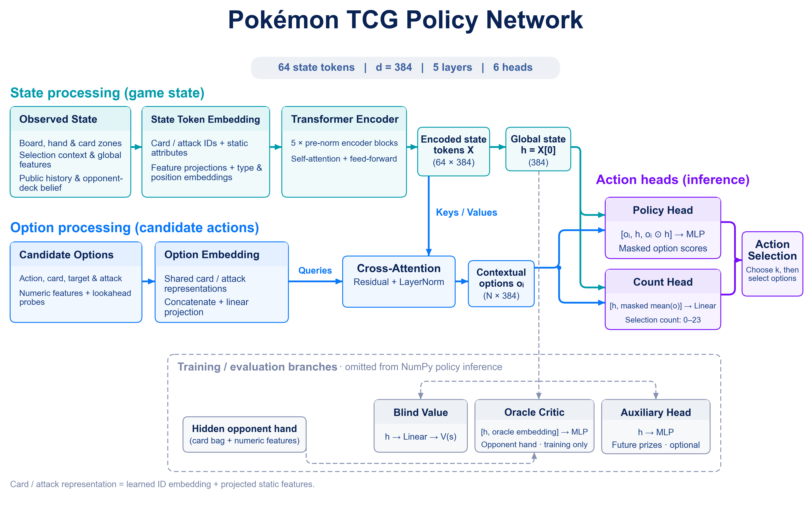
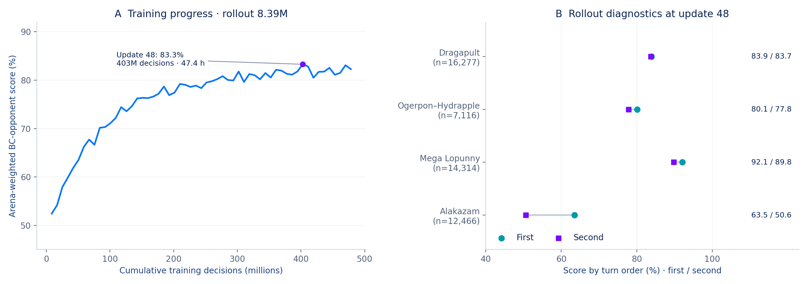
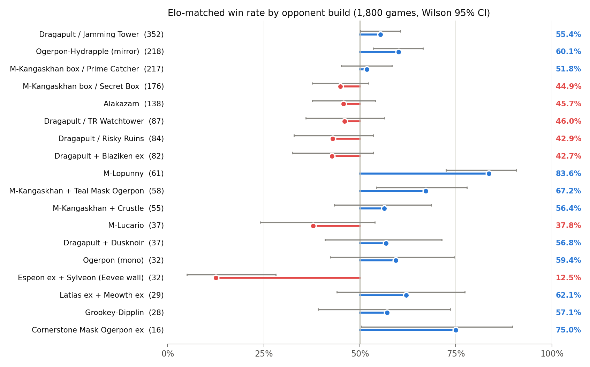

# 将前瞻结果转化为 PPO 的输入特征

**副标题：** 一个 780 万参数的策略网络，对局时不使用 MCTS，取得 Simulation 赛道第九名。

感谢主办方和 Kaggle 举办这次比赛，也感谢各位选手带来的精彩对局。

**TL;DR。** 两次最终提交使用完全相同的牌表和模型权重。一个约 780 万参数的网络结合场面信息和短程引擎试探，为合法动作评分。我先进行 behavioural cloning 和 value fine-tune，再用按竞技场构建的对手池训练 PPO。智能体最终取得第九名。

## 1. 卡组：厄诡椪–蜜集大蛇

我选用了一份公开牌表。草能量在这套卡组里既能带来抽牌，也能支持攻击、提高伤害，如何安排这些效果的先后顺序是打法的关键。

| 组件 | 卡牌 |
|---|---|
| 主攻手 | 4 张 Teal Mask Ogerpon ex；Applin、Dipplin、Hydrapple ex 各 2 张 |
| 进化引擎 | Chikorita、Bayleef、Meganium 各 2 张；4 张 Forest of Vitality |
| 展开 | 14 张基本草能量；4 张 Bug Catching Set；4 张 Ultra Ball；2 张 Poké Pad；2 张 Dawn |
| 抽牌与回收 | 4 张 Lillie's Determination；2 张 Meowth ex；Fezandipiti ex、Night Stretcher、Lana's Aid 各 1 张 |
| 干扰与应对 | 2 张 Boss's Orders；Judge、Unfair Stamp、Tapu Bulu 各 1 张 |

Teal Dance 给厄诡椪附加能量并抽一张牌；蜜集大蛇的 Ripening Charge 可以给任意己方宝可梦附加能量并治疗。大竺葵的 Wild Growth 让每张基本草能量提供的能量翻倍。Forest 允许草宝可梦在登场的回合进化，但玩家自己的第一个回合除外。

两个主攻招式看的能量位置不同。蜜集大蛇的 Syrup Storm 计算己方全场的草能量，厄诡椪的 Myriad Leaf Shower 则计算双方战斗宝可梦身上的能量。多铺几个厄诡椪可以增加抽牌和附能机会，但也要给两条进化路线留出备战区位置。

Bug Catching Set 可以同时找到能量和草宝可梦；Dawn 可以找齐三个进化阶段的宝可梦。Meowth 能找到需要的支援者，但也给对手多留了一个两奖赏目标。回收牌帮助我在被击倒后重新展开，Boss's Orders 则让我选择要击倒的宝可梦。大竺葵和卡璞·哞哞的非 ex 攻击能应对部分防御特性，代价是占用原本留给主攻手的资源。

## 2. 模型结构

*图 1：状态编码、候选动作评分与独立的训练分支。对手手牌输入只进入 oracle critic。*

模型将观察信息编码为 64 个 token，分别表示全局状态、选择上下文、场上位置、手牌、已展示卡牌、弃牌区、公开历史、记忆和己方未见卡牌（牌库与未翻开的奖赏卡）。编码器是宽度 384、六个注意力头的五层 Transformer。每张卡牌的表示包含两部分：可学习的 ID 嵌入，以及静态属性、特性和招式的结构化描述经过投影后的向量，两者相加。训练中的 ID dropout 鼓励模型在遇到不熟悉的卡牌时，也利用这些描述作出判断。

类型与位置嵌入用于区分区域和位置；填充掩码让注意力跳过空的手牌和展示牌位置。

模型为每个合法选项生成表示，输入包括动作特征及其对应的卡牌、目标和招式。选项再通过交叉注意力读取状态。例如，指向某个备战区位置的动作，可以读取该宝可梦当前的 HP 和能量。首个编码 token 作为全局表示 `h = X[0]`。MLP 对 `[o, h, o ⊙ h]` 评分，将动作、状态及两者的交互结合起来；另一个输出头预测选择数量。

共用的评分网络可以处理不同数量的候选动作，并将从其他动作中学到的经验用于当前选择。

数量头同时读取全局状态和候选动作表示的均值，24 个输出类别对应选择 0–23 个选项。掩码将可选数量限制在提示允许的范围内；每选中一个选项，后续选择就会将它排除。

训练时，两个 critic 负责估计回报，其中 oracle critic 还接收对手手牌快照；辅助头预测之后拿到的奖赏卡数量。部署时用 NumPy 执行策略网络，保留引擎特征，不运行在线 MCTS。

## 3. 特征工程

| 特征组 | 维度 | 编码内容与作用 |
|---|---|---|
| 全局状态与卡组判断 | 40 + 21 | 先后手、资源数量、每回合限用动作的使用情况；14 类流派加“其他”类别的概率判断提供对局背景。 |
| 选择上下文 | 68 + 2 个 ID | 提示类型、选择数量限制和剩余要求，用来区分攻击、检索与强制选择。 |
| 场上宝可梦 | 18 ×（32 + 4 个 ID） | HP、伤害、能量、道具、进化和登场时机，描述目标状态与展开限制。 |
| 卡牌区域 | ID、掩码、数量 | 30 个手牌位置、8 个展示牌位置、弃牌集合和己方未见卡牌池，描述可使用和可回收的资源。 |
| 日志与记忆 | 26 + 26 个 ID | 保存近期事件、累计出牌和附能次数、双方各四次攻击，以及至多 12 张已知对手卡牌，供后续决策使用。 |
| 基础动作 | 60 + ID | 动作类型、区域、卡牌、目标、招式、数量及目标属性，说明每个候选动作具体做什么。 |
| 引擎前瞻 | 28 | 伤害、击倒、奖赏与资源变化、新增合法攻击，直接提供动作的即时后果。 |

Opponent belief 指根据对手已公开的卡牌，估计对方属于哪种卡组流派。我将这些卡牌与回放中的精确牌表匹配，按牌表出现频率和卡牌重合程度加权，再按流派汇总权重并归一化，得到概率分布，作为全局状态输入网络。在 BC 训练期间，dropout 会偶尔将这个概率分布替换为“未知”，减少策略对卡组识别的依赖。

对满足条件的主要阶段单选决策，试探器最多评估 64 个候选，并在限定的展开范围内继续处理强制后续动作和抛硬币分支。

HP 按 400 缩放。选择数量采用对数编码，即使强制选择的数量很大，模型也能区分不同数量。目标属性与动作后果一同输入，让相同卡牌在不同局面中得到不同评分。

例如，附加一张能量可能让蜜集大蛇的攻击变为合法。试探器把这个变化交给网络，策略仍要判断：现在就攻击，还是先用另一个特性，把伤害推到击倒线。引擎提供局部后果，网络学习行动顺序和资源取舍。

试探器按固定方式补全隐藏区域，不读取对手真实手牌。抽牌或检索之后，部分选项数量特征会被屏蔽，避免结果依赖重建牌库时设定的牌序。这些特征描述动作的短程后果，不预测对手的完整应对。

## 4. 训练

### 第一步：behavioural cloning

我用 7 月 14 日至 8 月 12 日收集的约 13.6 万场回放建立训练集。通用模型先学习各流派、双方玩家在回放中作出的决策。随后，各流派模型都从这个通用模型的权重初始化，只使用操控对应流派时的决策数据，以较低学习率微调整个网络。同一流派内的不同精确牌表共同参与该流派模型的训练。

克隆训练中，获胜方决策的权重为 1.0，落败方为 0.3，同时使用十天尺度的时间衰减，并提高较强选手样本的权重。

### 第二步：value fine-tune

进入 PPO 前，我用起始策略生成对局，保持策略参数不变，用对局结果拟合两个 critic，使价值估计适应智能体实际遇到的状态，为 PPO 估计动作优势提供基准。

### 第三步：PPO

我训练的是一套固定卡组，纯自博弈会集中在镜像对局上，学不到其他卡组带来的威胁和奖赏交换方式。因此，我根据 8 月 12 日竞技场的 148 份不同牌表构建对手池，将镜像作为其中一部分。

| 对手组成 | 对局占比 | 作用 |
|---|---|---|
| 前 40 份精确的 60 卡牌表 | 75% | 按每份牌表在竞技场中的出现频率分配采样权重 |
| 变异牌表 | 10% | 在变异牌表中均匀采样，练习应对调整过的卡牌组合 |
| 主办方提供的四种初始脚本 | 10% | 覆盖简单但不同的打法，以应对天梯中 10% 的随机对手匹配 |
| 自身镜像 | 5% | 从双方视角练习镜像对局 |

每份原始牌表或变异牌表都由所属流派的 BC 模型操作，同流派的不同牌表共用该模型。镜像对局会同时采集双方的轨迹，因此它在训练样本中所占的比例高于对局比例。

变异牌表从各流派最常见的牌表出发，执行 5–10 次换牌操作。替换牌取自该流派已有的卡牌，数量上限采用该流派任一已观察牌表中的最大张数。生成的牌表包含 60 张卡，通过引擎验证后才加入对手池。

终局奖励为胜利 +1、失败 −1、平局 0。裁剪抑制策略的突然变化，价值回归改善回报估计，熵奖励则鼓励策略继续探索其他动作。广义优势估计由 oracle critic 提供。我使用 γ = 0.997、λ = 0.95、裁剪范围 0.2、学习率 1e-4。奖赏进度塑形和限制策略偏离克隆模型的惩罚，在八次更新内退火到零。

**为什么 rollout 要这么大？** 我先把每次更新前采集的决策数从 13.1 万提高到 52.4 万，发现训练胜率的上限提高了。这个结果促使我直接将 rollout 提到 839 万，是前一次的十六倍。训练胜率起初上升较慢，随后达到了更高的平台。

小 rollout 中，稀有对局只有少量样本，一次走运的开局就可能对更新产生较大影响。增大 rollout 后，每次更新前都能采集更多对局，覆盖先手和后手。平均绝对优势值从最初的 0.35，下降到接近最高训练胜率时的 0.16。我认为，采集更多对局有助于将较小的优势估计与对局之间的随机噪声区分开。代价是同样决策总量下，策略更新次数更少，这也能部分解释初期进步较慢的现象。

*图 2：左侧是按竞技场频率加权的训练胜率，每个固定克隆对手使用最近至多 300 场的滚动窗口，不含脚本、变异和镜像。右侧是第 48 次 rollout 中先后手分别的表现，n 为两种顺序的合计场数。平局按半胜计。*

最终 PPO 运行使用 8×RTX 4090，在 56.3 小时内完成 57 次更新。训练胜率从 52.4% 升至第 48 次更新时的 83.3%，此时累计约 4.03 亿次决策；第 45–57 次更新保持在 80.5%–83.3%。对胡地时，先手为 63.5%，后手为 50.6%；对多龙巴鲁托则分别为 83.9% 和 83.7%。

## 5. Kaggle 真实对战结果

我分别统计了两个最终提交在 8 月 21–31 日的 1,000 场已完成对局，合计 1,144 胜、3 平、853 负。平局按半胜计，整体胜率为 57.3%，两个提交分别为 56.8% 和 57.8%。

筛选出双方赛前评分相差不超过 200 的对局后，共有 1,800 场，胜率为 **53.5%**，近似 95% 区间为 **51.2%–55.8%**。另外 200 场的胜率为 91.5%。这个划分用于观察对手强度的影响，并不是 API 提供的真实匹配类型。

*图 3：此处“Elo-matched”指评分差不超过 200。图中展示至少 15 场的分组，省略的对局仍计入总体。“Mirror”包含所有蜜集大蛇牌表。圆点表示胜率，灰色线段为近似 Wilson 95% 区间。重复遇到同一对手可能使区间偏乐观。*

在评分差不超过 200 的对局中，面对完全相同的牌表，我取得了 **74 场 53 胜，即 71.6% [60.5%–80.6%]**。双方卡牌相同，这些对局更能反映策略如何使用卡组，不过对手水平仍有差异。

尽管胜率表明 BC 模型与在 Kaggle 上遇到的实际对手存在强度差距，因为模仿学习很难超越它所模仿的对象，但这些模型仍能作为 PPO 的有效训练对手，也能作为持续衡量当前策略水平的参照。

对 Espeon–Sylveon 的 32 场，我的胜率为 12.5%。仙子伊布的 Safeguard 能挡住两个主力 ex 的攻击伤害。大竺葵和卡璞·哞哞可以绕过这项防护，但太阳伊布的 Psych Out 又足以将它们从满血击倒。因此，对方牌表既能限制我的主攻手，也能应对备用攻击手。

## 6. 试过但没有奏效的方法

**MCTS。** 我尝试了对隐藏状态采样、以策略作为先验、以 critic 评估叶节点的 MCTS，但效果没有超过直接使用策略网络。在较短的行动预算内，搜索必须把算力分到多个隐藏状态样本；每棵树又会按其采样状态已经确定来规划。

**更大的网络。** 增加容量也没有带来提升。网络已经能读取详细的动作后果，因此我选择把预算花在更多训练经验上。

## 7. 可改进的地方

我会用共享服务合并多场对局的决策请求，批量推理，以便在同样的预算内采集更多训练经验。

我会更早给第一套卡组的训练预算设定上限，留出足够时间在提交前训练和评估第二套卡组。
