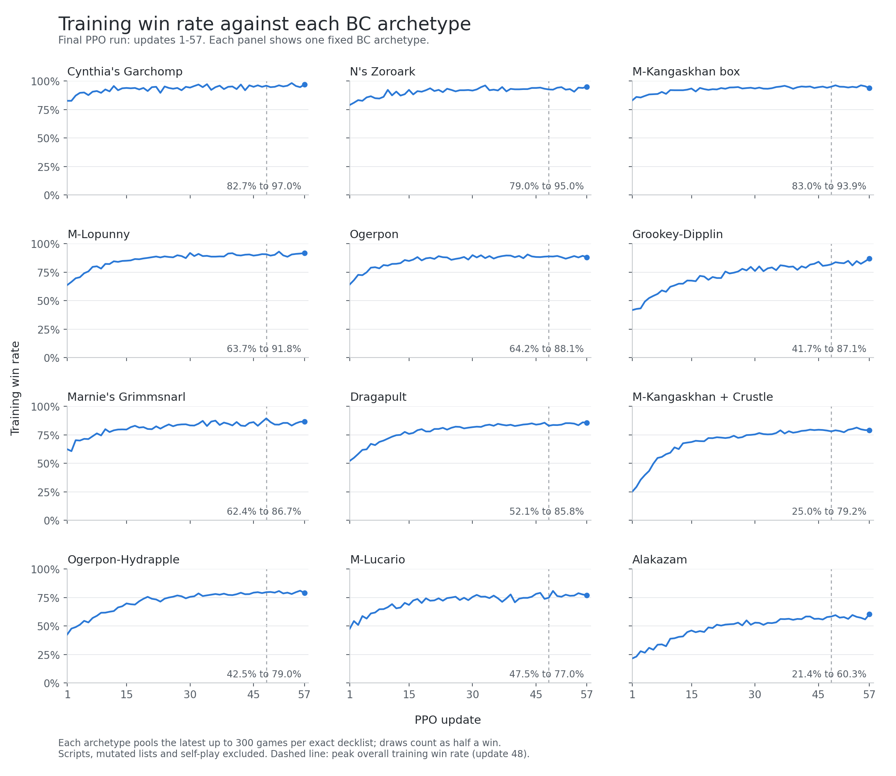

# 将前瞻结果转化为 PPO 的输入特征

**副标题：** 一个 780 万参数的策略网络，对局时不使用 MCTS，取得 Simulation 赛道第九名。

感谢主办方和 Kaggle 举办这次比赛，也感谢各位选手带来的精彩对局。

**TL;DR。** 两次最终提交使用完全相同的牌表和模型权重。有限引擎前瞻将动作后果提供给约 780 万参数的策略网络，由网络学习行动顺序和资源分配。我先进行 behavioural cloning 和 value fine-tune，再用按竞技场构建的对手池训练 PPO。

## 1. 卡组：厄诡椪–蜜集大蛇

我选用了一份公开牌表。草能量在这套卡组里既能带来抽牌，也能支持攻击、提高伤害。

| 组件 | 卡牌 |
|---|---|
| 主攻手 | 4 张 Teal Mask Ogerpon ex；Applin、Dipplin、Hydrapple ex 各 2 张 |
| 进化引擎 | Chikorita、Bayleef、Meganium 各 2 张；4 张 Forest of Vitality |
| 展开 | 14 张基本草能量；4 张 Bug Catching Set；4 张 Ultra Ball；2 张 Poké Pad；2 张 Dawn |
| 抽牌与回收 | 4 张 Lillie's Determination；2 张 Meowth ex；Fezandipiti ex、Night Stretcher、Lana's Aid 各 1 张 |
| 干扰与应对 | 2 张 Boss's Orders；Judge、Unfair Stamp、Tapu Bulu 各 1 张 |

Teal Dance 给厄诡椪附加能量并抽一张牌；蜜集大蛇的 Ripening Charge 可以给任意己方宝可梦附加能量并治疗。大竺葵的 Wild Growth 让每张基本草能量提供的能量翻倍。Forest 允许草宝可梦在登场的回合进化，但玩家自己的第一个回合除外。

两个主攻招式看的能量位置不同。蜜集大蛇的 Syrup Storm 计算己方全场的草能量，厄诡椪的 Myriad Leaf Shower 则计算双方战斗宝可梦身上的能量。多铺几个厄诡椪可以增加抽牌和附能机会，但也要给两条进化路线留出备战区位置。

Bug Catching Set 可以同时找到能量和草宝可梦；Dawn 可以找齐三个进化阶段的宝可梦。Meowth 能找到需要的支援者，但也给对手多留了一个两奖赏目标。回收牌帮助我在被击倒后重新展开，Boss's Orders 则让我选择要击倒的宝可梦。大竺葵和卡璞·哞哞的非 ex 攻击能应对部分防御特性，代价是占用原本留给主攻手的资源。

## 2. 模型结构

*图 1：状态编码、候选动作评分与独立的训练分支。对手手牌输入只进入 oracle critic。*

模型将观察信息转换为 64 个 token，再交给宽度 384、六个注意力头的五层 Transformer 编码。

类型与位置嵌入用于区分区域和位置；填充掩码让注意力跳过空的手牌和展示牌位置。

共用的 MLP 根据全局表示 `h = X[0]`，对 `[o, h, o ⊙ h]` 评分，将动作、状态及两者的交互结合起来。

数量头同时读取全局状态和候选动作表示的均值，24 个输出类别对应选择 0–23 个选项。掩码将可选数量限制在提示允许的范围内；每选中一个选项，后续选择就会将它排除。

训练时，两个 critic 负责估计回报。oracle critic 额外接收对手手牌快照，目的是减少价值估计中的不确定性，为 PPO 提供信息更充分的基准。这项私有输入不会进入策略网络。辅助头预测之后拿到的奖赏卡数量。部署时用 NumPy 执行策略网络，保留引擎特征，不运行在线 MCTS。

## 3. 特征工程

全部 1,267 张卡都使用同一种格式的 207 维静态特征，不适用的字段填零。

| 卡牌特征 | 维度 | 例子 |
|---|---|---|
| 基础属性 | 57 | 卡牌类型、HP、弱点、撤退费用、进化阶段及是否为 ex |
| 特性和训练家卡效果 | 32 | 抽牌、检索、附能、治疗、加速进化，以及使用限制和效果数量 |
| 两个招式 | 2 × 59 | 伤害、能量需求、抛硬币，以及伤害随能量或奖赏数量变化的机制 |

我用规则解析卡牌文本，提取效果字段，再应用已保存的修正。模型将卡牌特征映射成 64 维向量，再加上为每张卡单独学习的向量。即使效果特征相同，模型也能区分不同卡牌的身份。训练时，ID dropout 会偶尔去掉这个独立向量，鼓励模型利用共用的特征。这些特征无法编码每一条规则。

卡牌表示与局面信息组合：

| 局面信息 | 嵌入前维度 | 编码方式 |
|---|---|---|
| 场上宝可梦 | 18 ×（32 + 4 个 ID） | HP、能量、道具数量与第一张 ID、进化前卡牌数量及登场时机 |
| 卡牌区域 | 手牌 30；展示牌 8；每个牌袋 60 | 用 ID、掩码和数量表示手牌、已展示卡牌、弃牌及未见卡牌（牌库与未翻开的奖赏卡） |
| 全局状态 | 40 + 21 | 先后手、资源、动作使用情况及 opponent belief |
| 历史 | 26 + 26 个 ID | 近期事件及记忆中的公开卡牌 |
| 选择上下文 | 68 + 2 个 ID | 提示和选择数量限制 |
| 每个候选动作 | 60 + 28 + 3 个 ID | 基础动作特征、前瞻结果；卡牌、目标和招式 ID |

Opponent belief 用来估计对手的卡组流派。我将对手已公开的卡牌与回放牌表匹配，按牌表频率和重合程度加权，再汇总成 14 类流派加“其他”类别的概率。BC 期间，dropout 偶尔将这个分布替换为“未知”。

试探器提供动作的即时后果，供策略比较选择。对符合条件的主要阶段单选决策，它在临时引擎状态中分别执行最多 64 个候选动作，并在固定上限内继续处理强制后续动作和抛硬币分支。它为每个候选动作追加 28 维特征，包括伤害、击倒、获得的奖赏、手牌和牌库数量变化，以及合法攻击的变化。

以给蜜集大蛇附能为例，模型同时接收双方场面、卡牌区域、全局状态、历史、选择上下文和全部合法候选动作。蜜集大蛇的场上位置 token 由 32 个状态数值与四份 64 维卡牌表示组合而成，分别对应宝可梦、第一张道具和前两张能量卡。拼接得到的 288 维再投影到 384 维。每个候选动作通过交叉注意力读取完整局面。附能动作的试探特征可以标记新增的合法攻击，而手牌资源和对手的威胁则帮助策略将它与其他合法动作比较。

## 4. 训练

### 第一步：behavioural cloning

我使用 8 月 3–12 日的回放训练 BC。通用模型先学习各流派、双方玩家在回放中作出的决策。随后，各流派模型都从这个通用模型的权重初始化，只使用操控对应流派时的决策数据，以较低学习率微调整个网络。同一流派内的不同精确牌表共同参与该流派模型的训练。

克隆训练中，获胜方决策的权重为 1.0，落败方为 0.3，同时提高较新对局和较强选手样本的权重。

### 第二步：value fine-tune

我用经过流派微调的 Ogerpon–Hydrapple BC 模型生成对局，保持策略参数不变，用对局结果拟合两个 critic。随后，PPO 从这个完成 value fine-tune 的模型开始训练，此时价值估计已针对策略实际遇到的状态作了校准。

### 第三步：PPO

固定卡组的纯自博弈学不到其他流派带来的威胁和奖赏交换方式。因此，我根据 8 月 12 日竞技场的 148 份不同牌表构建对手池。

| 对手组成 | 对局占比 | 作用 |
|---|---|---|
| 前 40 份精确的 60 卡牌表 | 75% | 按每份牌表在竞技场中的出现频率分配采样权重 |
| 变异牌表 | 10% | 在变异牌表中均匀采样，练习应对调整过的卡牌组合 |
| 主办方提供的四种初始脚本 | 10% | 覆盖简单但不同的打法，以应对天梯中 10% 的随机对手匹配 |
| 自身镜像 | 5% | 从双方视角练习镜像对局 |

每份原始牌表或变异牌表都由所属流派的 BC 模型操作，同流派的不同牌表共用该模型。镜像对局会同时采集双方的轨迹，因此它在训练样本中所占的比例高于对局比例。

变异牌表从各流派最常见的牌表出发，执行 5–10 次换牌操作。替换牌取自该流派已有的卡牌，数量上限采用该流派任一已观察牌表中的最大张数。生成的牌表包含 60 张卡，通过引擎验证后才加入对手池。

终局奖励为胜利 +1、失败 −1、平局 0。裁剪抑制策略的突然变化，价值回归改善回报估计，熵奖励则鼓励策略继续探索其他动作。广义优势估计由 oracle critic 提供。我使用 γ = 0.997、λ = 0.95、裁剪范围 0.2、学习率 1e-4。奖赏进度塑形和限制策略偏离克隆模型的惩罚，在八次更新内退火到零。

**为什么 rollout 要这么大？** 我先把每次更新前采集的决策数从 13.1 万提高到 52.4 万，发现训练胜率的上限提高了。这个结果促使我直接将 rollout 提到 839 万，是前一次的十六倍。

小 rollout 中，稀有对局只有少量样本，一次走运的开局就可能对更新产生较大影响。增大 rollout 后，每次更新前都能采集更多对局，覆盖先手和后手。平均绝对优势值从最初的 0.35，下降到接近最高训练胜率时的 0.16。我认为，采集更多对局有助于将较小的优势估计与对局之间的随机噪声区分开。代价是同样决策总量下，策略更新次数更少。

*图 2：左侧是按竞技场频率加权的训练胜率，每个固定克隆对手使用最近至多 300 场的滚动窗口，不含脚本、变异和镜像。右侧是第 48 次 rollout 中先后手分别的表现，n 为两种顺序的合计场数。平局按半胜计。*

最终 PPO 运行使用 8×RTX 4090，在 56.3 小时内完成 57 次更新。训练胜率从 52.4% 升至第 48 次更新时的 83.3%，此时累计约 4.03 亿次决策；第 45–57 次更新保持在 80.5%–83.3%。对胡地时，先手为 63.5%，后手为 50.6%；对多龙巴鲁托则分别为 83.9% 和 83.7%。

*图 3：对 12 个固定 BC 流派的训练进展，每条曲线汇总各精确牌表的滚动窗口。从首次到最后一次记录的 rollout，所有流派的胜率均有提高；胡地始终最难应对。*

## 5. Kaggle 真实对战结果

我分别统计了两个最终提交在 8 月 21–31 日的 1,000 场已完成对局，合计 1,144 胜、3 平、853 负。平局按半胜计，整体胜率为 57.3%，两个提交分别为 56.8% 和 57.8%。

筛选出双方赛前评分相差不超过 200 的对局后，共有 1,800 场，胜率为 **53.5%**，近似 95% 区间为 **51.2%–55.8%**。另外 200 场的胜率为 91.5%。这个划分用于观察对手强度的影响，并不是 API 提供的真实匹配类型。

*图 4：此处“Elo-matched”指评分差不超过 200。图中展示至少 15 场的分组，省略的对局仍计入总体。“Mirror”包含所有蜜集大蛇牌表。圆点表示胜率，灰色线段为近似 Wilson 95% 区间。重复遇到同一对手可能使区间偏乐观。*

在评分差不超过 200 的对局中，面对完全相同的牌表，我取得了 **74 场 53 胜，即 71.6% [60.5%–80.6%]**。双方使用相同的牌表，因此这组胜率也体现了模型运用这套卡组的水平。

尽管胜率表明 BC 模型与在 Kaggle 上遇到的实际对手存在强度差距，因为模仿学习很难超越它所模仿的对象，但这些模型仍能作为 PPO 的有效训练对手，也能作为持续衡量当前策略水平的参照。

对 Espeon–Sylveon 的 32 场，我的胜率为 12.5%。仙子伊布的 Safeguard 能挡住两个主力 ex 的攻击伤害。大竺葵和卡璞·哞哞可以绕过这项防护，但太阳伊布的 Psych Out 又足以将它们从满血击倒。因此，对方牌表既能限制我的主攻手，也能应对备用攻击手。

## 6. 试过但没有奏效的方法

**MCTS。** 我尝试了对隐藏状态采样、以策略作为先验、以 critic 评估叶节点的 MCTS，但效果没有超过直接使用策略网络。每次行动的时间有限，搜索必须把算力分到多个隐藏状态样本；每棵树又会按其采样状态已经确定来规划。

**更大的网络。** 增加容量也没有带来提升。网络已经能读取详细的动作后果，因此我选择把预算花在更多训练经验上。

## 7. 可改进的地方

这次比赛中，我没有安排好时间，最后没能为其他卡组新训练模型。我会更早给第一套卡组的训练预算设定上限，留出足够时间在提交前训练和评估第二套卡组。

我会用共享服务合并多场对局的决策请求，批量推理，以便在同样的预算内采集更多训练经验。
